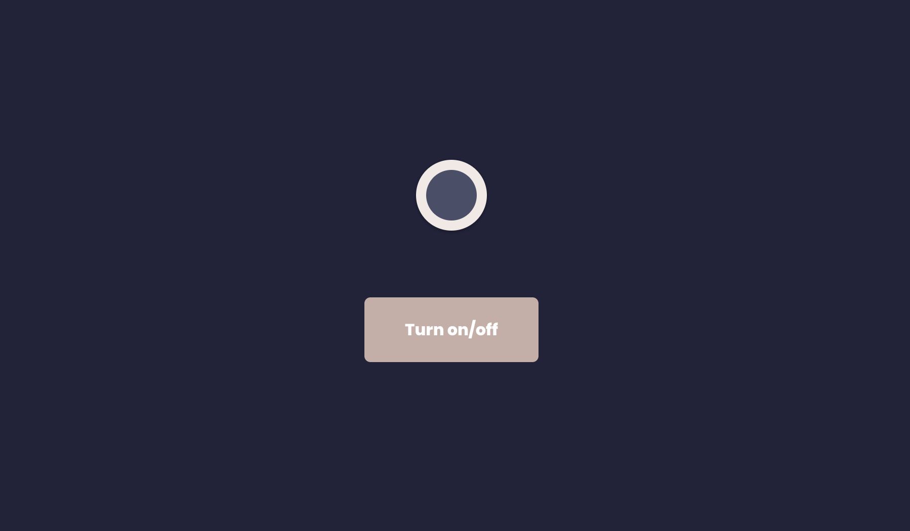

# Opdrachtbeschrijving

## Inleiding

Je gaat ervoor zorgen dat de gebruiker het licht van deze applicatie aan- en uit kan zetten. Dit ga je doen door gebruik te maken van State. Bovendien zal de gebruiker straks direct kunnen zien wanneer het licht aan of uit staat, door het gebruik van conditionele styling.



Het project is opgezet met [Vite](https://vitejs.dev/).

## Applicatie starten

Als je het project gecloned hebt naar jouw locale machine, installeer je eerst de `node_modules` door het volgende
commando in de terminal te runnen

```shell
npm install
```

Wanneer dit klaar is, kun je de applicatie starten met behulp van:

```shell
npm run dev
```

... of gebruik de WebStorm knop (npm run dev). Open http://localhost:5173 om de pagina in de browser te bekijken. Begin met
het maken van wijzigingen in `src/App.jsx`: elke keer als je een bestand opslaat, zullen de wijzigingen te zien zijn op
de webpagina.

## Opdrachtbeschrijving
Volg onderstaande stappen één voor één op:

1. Begin met het creëren van State, om daarin op te slaan of het licht uit (`false`) of aan (`true`) staat. Belangrijk: geef de waarde van de state weer in een `console.log`, zodat je het kunt zien wanneer de waarde van de state veranderd.
2. Zorg ervoor dat wanneer de gebruiker op de knop klikt, de State waarde wordt omgedraaid. Dit doe je door de state-setter methode te gebruiken die je in stap 1 hebt aangemaakt. Dus: is de waarde `false`? Dan wordt het `true`. Is de waarde `true`? Dan wordt de waarde `false`. Hiervoor zul je [de logica operator !](https://developer.mozilla.org/en-US/docs/Web/JavaScript/Reference/Operators/Logical_NOT) moeten gebruiken. _TIP:_ test of het ook werkt als je vaker achtereen blijft klikken.
3. Voeg conditionele styling toe. Wanneer het licht aan staat, moet de class `on` op het **main-element** staan. Wanneer het licht uit staat, moet de class `off` op dit element staan.
4. Maak ten slotte de button-tekst dynamisch. Wanneer het licht aan staat, geef je de tekst 'Turn off' weer. Wanneer het licht uit staat, geef je de tekst 'Turn on' weer.
